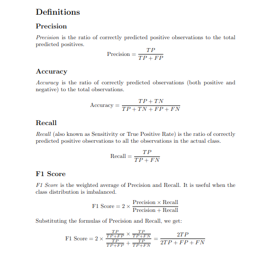
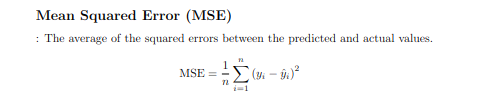
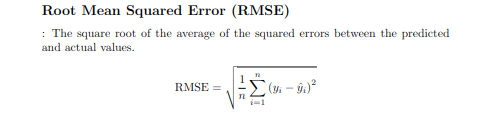

# Machine Learning Theory

Machine learning concepts lie in humans trying to make computers develop a mechanism to learn patterns and motives from datasets.

## Basic Process of ML Models

The first step of using a machine learning algorithm is to gather the data. Depending on the kind of information we need to process, this initial data may come from people (e.g., a customer survey) or sensors (e.g., trying to predict the average temperature of a room). 

Next, we need to split the data into two parts:
1. **Train dataset**: Used to train the model.
2. **Test dataset**: Used to evaluate the model's performance.

The model is trained with the training dataset, and it compares its predictions to the real values of the train data to adjust its parameters for better performance. After tuning the hyperparameters, the model is tested with the test dataset to define its quality.

Depending on the task, we can have two types of ML problems:
1. **Classification**: Predicting a category (e.g., determining if an image depicts a dog or a cat).
2. **Regression**: Predicting a continuous value (e.g., predicting the selling price of a house or the temperature of a room).

## Kinds of ML

The two main categories of Machine Learning algorithms are:
1. **Supervised Learning**: The input data is labeled (e.g., KNN, Linear Regression). For instance, in a dog/cat classification task, images are mapped to the labels 'dog' or 'cat'.
2. **Unsupervised Learning**: The input data is unlabeled (e.g., K-means, HAC). The goal is to cluster data points to distinguish classes within the information.

## Metrics of Algorithms

The model updates its parameters based on a metric that specifies how good its predictions are. It evaluates this by comparing the predictions with the real values of the training dataset. Different metrics are used for classification and regression problems, which we will explain in detail.

### Classification Metrics

In general, multi-class classification deals with multiple classes of data points. For instance, predicting the education level of a person (e.g., PhD, High-School, College, Other) based on their marital status, age, and job. These characteristics are called features.

For better understanding, we will use the binary classification problem (e.g., male/female, ill/not ill). The model can have two states of prediction:
1. **Correct Prediction**:
   - **True Positives (TP)**: The person has the illness, and we predict they have it.
   - **True Negatives (TN)**: The person does not have the illness, and we predict they do not have it.
2. **Incorrect Prediction**:
   - **False Negatives (FN)**: We predict the person does not have the illness, but they do.
   - **False Positives (FP)**: We predict the person has the illness, but they do not.

This information can be depicted using the confusion matrix of the algorithm.

In order to better understand the ideas of the metrics I will cit their definitions :

The mose intuitive one is the accuracy which simply expresses the percent of the correct decisions we make. In a balanced dataset this is a pretty good metric and it provides a useful evaluation method. On the other side , in unbalanced data accuracy may be deceiving because in the example of the dog/cat classification if we have a dataset with 99 dogs and 1 cat if we make a pretty simple model telling that we decide dog the accuracy will be 99% even though the model is not even close to good performance. Another example is the illness classification in which , supposing we talk about a rare disease we can't expect that the data will be balanced. TO have an extra level of control we insrted the ideas of precision and recall but they don't have a great penalty for outliers, values that are extremely off the data points. This is done using the f1 score which is the harmonic mean of the two latter ideas and it punishes extreme differences between recall and precision.
### Regression Metrics
The above formulas cannot be use in this type of tasks since we don't have correct or false predictions, as we predict continuous values. In this direction we need a mathematical formula that keeps in mind the difference between the predicted and actual value. The first metric is the mean absolute error(MAE):

Following the logic in classification, we need to penalty the big differences between prediction and actual values we insert the mean squared error(MSE) in which we square the difference:

The only problem with the above lies on the fact that the error is represented in units squared and it is difficult to interpret(like the MSE is 10000$ squared) so the final one is the root mean squared error (RMSE) to get back to units:

